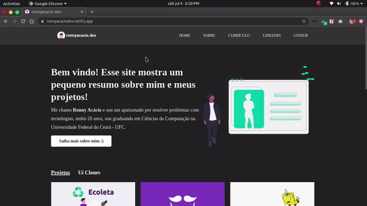

<h1 align="center">
  
</h1>

  

  

  

  

  

  

 

## 💻 Projeto

Como todos sabemos, nós desenvolvedores temos que investir bastante no nosso marketing pessoal e tentar mostrar o nosso conhecimento o máximo possível, sendo assim, resolvi criar esse site totalmente com ReactJS, para que todos possam me conhecer melhor, ver os meus projetos pessoais e saber quais tecnologias eu domino e estou estudando!

## 🌐 Preview

<h1 align="center">
    
</h1>

## 🚀 Tecnologias

Esse projeto foi desenvolvido com as seguintes tecnologias:

- [React](https://reactjs.org)
- [TypeScript](https://www.typescriptlang.org/)
- [React Router](https://reactrouter.com/web/guides/quick-start)
- [Styled Components](https://styled-components.com/)

 

## 🔨 Deploy Netlify

 

  Made with 🖤 by <a href="https://www.linkedin.com/in/ronnyacacio/"> Ronny Acácio </a>

